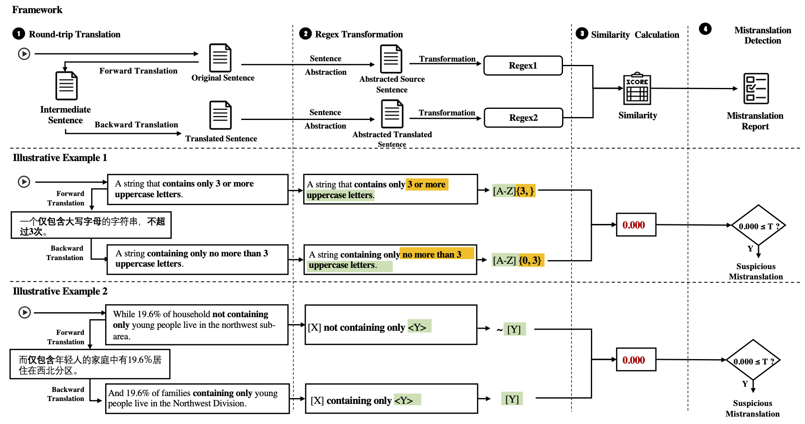

# SemMT

SemMT, an automatic testing approach for machine translation systems based on semantic similarity checking. It applies round-trip translation and measures the semantic similarity between the original and the translated sentences.

The key insight is that the semantics concerning **logical relations and quantifiers** in sentences can be captured by regular expressions (or deterministic finite automata) where efficient semantic equivalence/similarity checking algorithms can be applied.


## Workflow of SemMT



### Step 1. Round-trip Translation

Round-trip Translation translates a given text or sentence into an intermediate language (the forward translation), and then translates the result back into the source language (the back translation). The benefit of adopting RTT in our methodology is that the semantics of the source and back-translated sentences can be uniformly measured and compared in the same language. 


### Step 2. Regex Transformation

This step abstracts and transforms the source and translated sentences into regular expressions using NL2RE model. 


### Step 3. Similarity Calculation

This step calculates the semantic similarity between the regular expressions based on three regex-related metrics. 

We proposed three metrics to measure semantic similarities:

- **Regex-based Similarity (SemMT-R)**: computes the Levenshtein distance between two regular expressions
- **DFA-based Similarity (SemMT-D)**: computes the Jaccard similarity between the regular languages of two regular expressions
- **Hybrid Similarity (SemMT-H)**: a hybrid metric to enjoy both advantages by combining SemMT-R and SemMT-D with customized weights.


### Step 4. Mistranslation Detection

This step detects the mistranslation according to customized thresholds and reports the detected mistranslations.


## Reproduction

### Prerequisite

Python 3.6+

```shell
pip3 install -r requirements.txt
```


### Training Data Preparation

The training data of our regular expression transformer can be found at [NL-RX-Synth-Augmented.txt](./data/Training-Data/NL-RX-Synth-Augmented.txt)

The original data can be found at [NL-RX-Synth.txt](./data/Training-Data/NL-RX-Synth.txt)

 


### RQ1. Effectiveness of SemMT

To evaluate the effectiveness of our SemMT, we randomly sampled 500 sentences from the NL-RX-Synth dataset, applied the round-trip translation and collected the translation results. We then transformed both the original sentences and the round-trip translation results into regular expressions by the trained transformation model, which is described earlier in the experiment setup.

- Dataset with labels can be found [here](/data/RQ1-RQ3-Bug-Detection/bug_detection_label.csv)
- An executable demo can be found [here](https://github.com/SemMT-ICSE21/SemMT/blob/master/code_book/metrics_calculation.ipynb), it includes:

  - A snippet of how similarity metrics are calculated over a pair of sentences
  - Visualization of Accuracy, Precision, Recall, Fscore (also Sensitivity and Specificity)


### RQ2. Comparison with Existing Works

In RQ2, the 200 initial seeds are in [Seeds](./data/RQ2-Existingwork-Comparison/Seeds/initial_seed_200.txt).

For the experimental result of each work, please see the following folder:

- [PatInv](./data/RQ2-Existingwork-Comparison/PatInv/)

- [SIT](./data/RQ2-Existingwork-Comparison/SIT/)

- [TransRepair](./data/RQ2-Existingwork-Comparison/TransRepair/)

- [SemMT](./data/RQ2-Existingwork-Comparison/SemMT/)


An executable demo can be found [here](https://github.com/SemMT-ICSE21/SemMT/blob/master/code_book/comparison_with_existing_work.ipynb), it includes:

- Read in bug report
- Visualization of comparisons
- Best result presentation


### RQ3. Can SemMT find bugs that are not detected by other metrics?

Dataset with labels can be found [here](/data/RQ1-RQ3-Bug-Detection/bug_detection_label.csv)


An executable demo can be found [here](https://github.com/SemMT-ICSE21/SemMT/blob/master/code_book/metrics_calculation.ipynb), it includes:

- A snippet of how similarity metrics are calculated over a pair of sentences
- Venn figure of bugs detected by each similarity metrics


### RQ4. Applicability of SemMT


- [Impact of Translator Under Test](./data/RQ4-Applicability/Bing.csv)
- [Impact of Language Pair](./data/RQ4-Applicability/EN-JP.csv)
- [Impact of Test Dataset](./data/RQ4-Applicability/KB13.csv)


### Motivation

- Dataset preparation
  
    Download the datasets below, and put them under `data/Motivation`. For example, `data/Motivation/ReutersNews106521`
    
    - **Reuters** (109,110 news) can be downloaded [here](https://github.com/philipperemy/financial-news-dataset)
    - **WMT-News.en-es.en** can be downloaded [here](http://www.statmt.org/wmt19/translation-task.html)
    - **commoncrawl.es-en.en** can be downloaded [here](http://www.statmt.org/wmt19/translation-task.html)
    - **banking and finance** can be found [here](data/Motivation/banking_finance.txt)
    - **news-commentary-v8.es-en.en** can be downloaded [here](http://www.statmt.org/wmt19/translation-task.html)
    - **europarl-v7.es-en.en** can be downloaded [here](http://www.statmt.org/wmt19/translation-task.html)
    
- The script can be found [here](./code_book/stats-motivation.ipynb)


## Notes

### Preprocessing

- The sentences in the dataset are pre-process by the following steps (the same as the [original paper](https://aclanthology.org/D16-1197/)):
  - Lower all the cases in the sentence
  - Replace the keywords as follows
    - \<M0\> -> \'dog\'
    - \<M1\> -> \'truck\'
    - \<M2\> -> \'ring\'
    - \<M3\> -> \'lake\'

- The regular expressions generated are in raw forms. They can be transformed to normal regular expressions by the following replacing rules:

```python
regex = regex.replace("<VOW>", " ".join('AEIOUaeiou'))
regex = regex.replace("<NUM>", " ".join('0-9'))
regex = regex.replace("<LET>", " ".join('A-Za-z'))
regex = regex.replace("<CAP>", " ".join('A-Z'))
regex = regex.replace("<LOW>", " ".join('a-z'))

regex = regex.replace("<M0>", " ".join('dog'))
regex = regex.replace("<M1>", " ".join('truck'))
regex = regex.replace("<M2>", " ".join('ring'))
regex = regex.replace("<M3>", " ".join('lake'))
```

